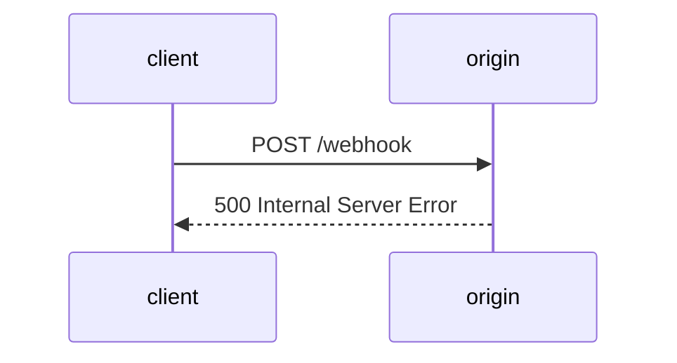
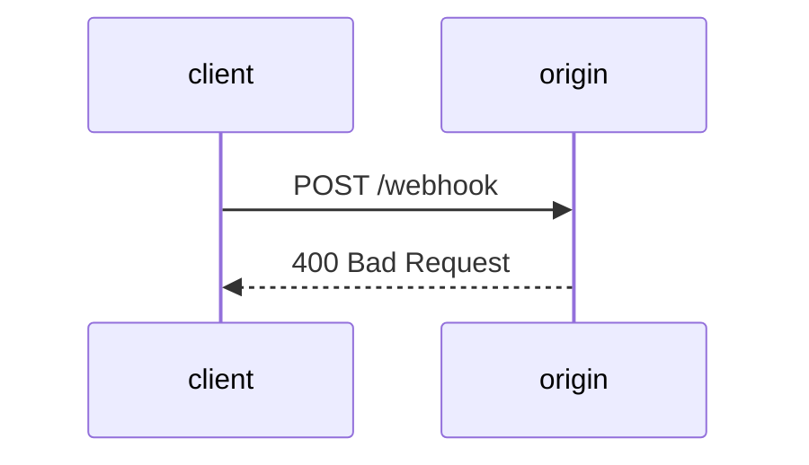
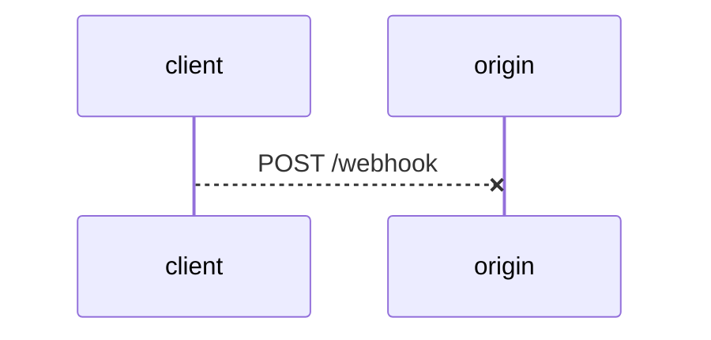
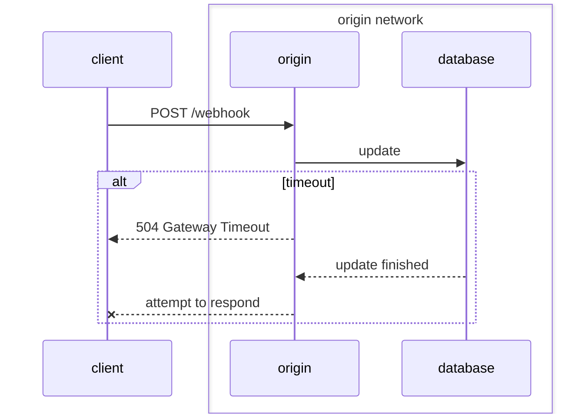
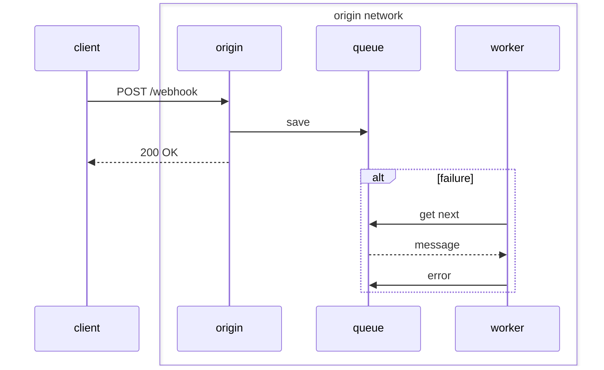

+++
title = "Webhook Failure Scenarios"

[taxonomies]
tags=["webhook"]
+++

A webhooks allow two applications to communicate events. It is relatively simple to get started using webhooks using HTTP and JSON. However, there a number of failure scenarios that developers should be aware of in order to make their webhook implementation robust.

<!-- more -->

## Terminology

For this post we are using the following terms:

- client - A program that sends a webhook request.
- origin - A service that processes and responds to webhook requests.

## Unhealthy Origin

The client sends a valid request but receives a 500 HTTP response code (or any 5xx server error) from the origin. This is the most common failure mode.  The cause of the unhealthy origin may be do to an explicit change, such as deploying a new version of the origin service. The error may also be caused by an unhealthy service upstream of the origin, such as a databased used by the origin becomming unavailable.

## Invalid Request

The client sends a request that does not conform to the origin's specification. The may be due to incorrect or missing data from the HTTP body or the HTTP headers. For example: the request may be missing a `Content-Type: application/json` header or is sending a boolean as a string in the body `{ "active": "true" }` instead of `{ "active": true }`. This error may not always be the fault of the client. The origin may have been updated in such a way that that previous requests were successful, but new requests are not. For example: the origin did not require a `Content-Type` header but now does. Or the origin used to accept both `"true"` and `true` as valid boolean value but is now more strict.

## Network Error

The client sends a request to the origin but the request never reaches the origin. Network errors can happen whether we are sending the request over the internet or using a VPN tunnel. Modern networks are complex and there are many reasons why the network can fail:

- dns - When sending a webhook request using an URI (domain name), the client may not be able to determine the IP address. Example: the client is unable to resolve an IP address for the request URI.
- tcp - The network protocol underlying HTTP failed. Example: the origin has an unrecoverable error and issues a TCP reset.
- http - The error occurred within the HTTP protocol. Example: the client sent the request using HTTP/2 but the origin only understands HTTP/1. 

The cause of the network failure may be related to the client, the origin or somewhere in between. For example: requests are normally sent over the internet which involves transiting through Comcast's network. If Comcast has an issue, the requests will be dropped until network operators re-route traffic to another provider, such as Level3.

A network timeout error is a special case that we discuss below.

## Origin Timeout

The client sends a request to the origin, but a timeout occurs. The timeout may be from the origin, often in the form of a 504 Gateway Timeout error. The client may also timeout after a certain amount of time.

According to the client, a timeout is an error. However, the origin may have partially or completely processed the request. This makes it difficult for the client to know if it should re-send the request or not.

To understand why the origin would continue processing the request when a timeout occurs, we need to understand how HTTP requests are normally processed. Let us use an example where the origin receives a webhook request for updating inventory. When the origin receives that request, it will update a SQL database with the new inventory count. The origin will wait until the SQL update finishes and then send a response. If that update is blocked for a long time, the client may give up and timeout. The update finally succeeds and the origin attempts to send a response, however the client has already given up and the response cannot be sent. In this scenario, the client has recorded a timeout error but the origin has processed the request.

## Origin Dropped Request

The origin responds with a 2xx HTTP response code but does not actually process the request. This is one of the more insidious failure modes because it is almost impossible for the client to detect. Worse still, this issue is normally discovered days or weeks after it first occurs.

Many origins will synchronously process webhook requests. However, some origins choose to asynchronously process requests. This means the origin receives a request, writes a message to a queue for later processing and responds with a 2xx HTTP response code. The intention is for some other service to process the message in the queue. Unfortunately, the message may never get processed. The queue may drop the message, a service may encounter an error while trying to process the message or a service may fail to properly process the message and mistakenly mark the message as processed.

The false-positive of a successful response and the delay in detecting this issue makes this scenario one of the more challenging failure modes to resolve. Examples:

- The client may no longer have access to the data to re-send the request.
- Some requests cannot be safely re-sent. For example: an old inventory update request should not be sent because a newer request already updated the inventory to the correct value.

## Simple, Not Easy

The concept of webhooks are simple, but it is not easy to properly implement webhooks in a way that is robust and dependable. If the above scenarios are not properly handled, a webhook implementation is at risk of data loss and will require a support team to resolve incidents. Some failure scenarios are not possible to defend against without first documenting the interface, including pre-conditions and post-conditions, that both the origin and client should adhere to.

